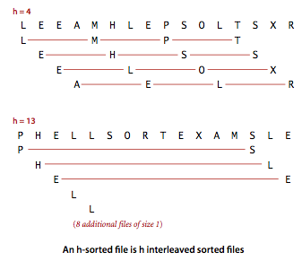
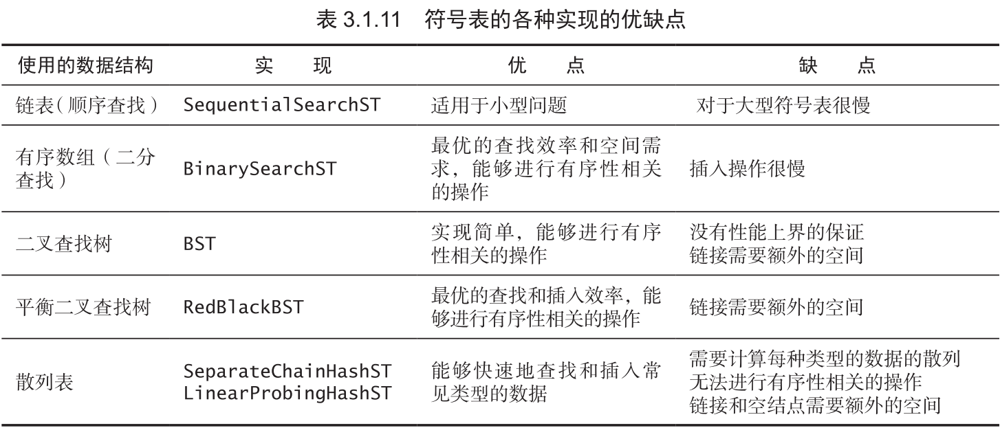

# Algorithms

* [算法复杂度分析](#算法复杂度分析)
* [排序算法](#Sorting)
  * [冒泡排序](#冒泡排序-Bubble-Sort)
  * [选择排序](#选择排序-Selection-Sort)
  * [插入排序](#插入排序-Insertion-Sort)
  * [希尔排序](#希尔排序-Shell-Sort)
  * [归并排序](#归并排序-Merge-Sort)
  * [快速排序](#快速排序-Quick-Sort)
  * [堆排序](#堆排序-Heap-Sort)
* [查找](#Searching)
  * [二分查找](#二分查找-Binary-Search)
  * 二叉搜索树
  * 红黑树
  * 散列表

## 算法复杂度分析
待完成

## Sorting
#### 冒泡排序 Bubble Sort
一次巡回中，如果出现逆序的情况，就交换，一直往后移动直至巡回结束，开始下一个巡回，当没有交换发生的时候则结束。每次巡回的时候最后的元素是最大的。时间复杂度O(N^2)

```py
def bubble_sort(lst):
    if lst == []:
        return []
    for i in range(len(lst)):
        for j in range(1, len(lst) - i):
            if lst[j-1] > lst[j]:
                lst[j-1], lst[j] = lst[j], lst[j-1]
    return lst
```

#### 选择排序 Selection Sort
- 思想：最开始，找到数组中最小的元素，将其和数组第一个元素交换位置；然后在剩下的元素中找到最小的元素，将其和数组的第二个元素交换位置，如此往复。。。简单地说，就是不断在剩余元素中选取最小者放到剩余元素的首位。
- 复杂度：大约会进行N次交换以及N^2次比较
- 特点：
    - 运行时间和输入无关；不管初始输入是有序数组还是随机排列的数组，排序时间都是一样长的
    - 数据的移动最少，只需N次移动

Python版：
```py
def select_sort(lst):
    if not lst:
        return []
    for i in range(len(lst) - 1):
        smallest = i
        for j in range(i, len(lst)):
            if lst[j] < lst[smallest]:
                smallest = j
        lst[i], lst[smallest] = lst[smallest], lst[i]
    return lst
```

Golang版：
```go
func SelectionSort(lst []int) []int {
    if len(lst) == 0 {
        return lst
    }
    for i := 0; i < len(lst); i++ {
        smallest := i
        for j := i + 1; j < len(lst); j++ {
            if lst[j] < lst[smallest] {
                smallest = j
            }
        }
        lst[i], lst[smallest] = lst[smallest], lst[i]
    }
    return lst
}
```

#### 插入排序 Insertion Sort
- 思想：指针从数组的左边到右边，指针的左边总是排好序的，每次都将指针右边的第一个元素插入到指针左边已经排好序的数组中（方法是依次和前面的元素比较直到位置固定），然后将指针向右移动，当指针到达整个数组最右端时，说明排序已经完成
- 时间复杂度：
    - 比较：O(N^2)；最好情况：O(N-1)
    - 交换：O(N^2)；最好情况：0次
- 优点：如果一个数组中的元素都是有序的，使用插入排序能够在线性时间内完成排序，不需要对元素进行移动。对于部分有序的数组和小规模数组很有效

Python版：
```py
def insert_sort(lst):
    if not lst:
        return []
    for i in range(1, len(lst)):
        j = i
        while j > 0 and lst[j] < lst[j-1]:
            lst[j-1], lst[j] = lst[j], lst[j-1]
            j -= 1
    return lst
```

Golang版：
```go
func InsertionSort(lst []int) []int {
    if len(lst) == 0 {
        return lst
    }
    for i := 1; i < len(lst); i++ {
        for j := i; j > 0 && lst[j] < lst[j-1]; j-- {
            lst[j-1], lst[j] = lst[j], lst[j-1]
        }
    }
    return lst
}
```

#### 希尔排序 Shell Sort
- 简介：这是一个比前两种排序算法要复杂一些的算法，它对于很多随机数组都非常高效，对于大型数组的表现也非常好。它的运行时间达不到平方级别。对其性质的数学论证很复杂，至今无法准确描述其性能，无法证明对其最好的递增序列，不知道其所需要的平均比较次数
- 思想：首先介绍**h有序数组**的概念，一个h有序数组是指数组种任意间隔为h的两个元素是有序的（注意是说这两个元素有序，不是说这两个元素之间的所有元素是有序的）；一个h有序数组可以看作由h个互相独立的有序数组编织在一起组成的一个数组，下面是例子：

- 插入排序的思想是交换相邻的元素使之有序，而希尔排序的思想是交换间隔为h的元素，使数组变成一个h有序数组。然后，逐渐减小h的值，最终使之变成一个1-有序数组，那么整个数组就排好序了。那么如何选取h的下降规则呢，一个比较常用的是将h从N/3开始递减至1，这个序列就叫做递增序列
- 和插入排序对比：对于大规模数组，插入排序的元素只能一点一点从数组一端移到另一端；而希尔排序考虑了子数组的规模和有序性，比插入排序更快。希尔排序的代码就是在插入排序代码的基础上把移动元素的距离改为h

Python版：
```py
def shell_sort(lst):
    if not lst:
        return []
    h = 1
    while h < len(lst)/3:
        h = 3*h + 1  # 1, 4, 13, 40, 121, 364...
    while h >= 1:
        for i in range(h, len(lst)):
            j = i
            while j >= h and lst[j] < lst[j-h]:
                lst[j], lst[j-h] = lst[j-h], lst[j]
                j -= h
        h /= 3
    return lst
```

Golang版：
```go
func ShellSort(lst []int) []int {
    if len(lst) == 0 {
        return lst
    }
    h := 1
    for h < len(lst)/3 {
        h = h*3 + 1  // 1, 4, 13, 40, 121, 364...
    }
    for h >= 1 {
        for i := h; i < len(lst); i++ {
            for j := i; j >= h && lst[j] < lst[j-h]; j -= h {
                lst[j], lst[j-h] = lst[j-h], lst[j]
            }
        }
        h /= 3
    }
    return lst
}
```

#### 归并排序 Merge Sort
- 思想：采用了分治算法（divide-and-concur）的思想，将待排序的数组分为两半，对这两半数组**递归**地使用归并排序。两边排好序之后，从首元素开始比较，哪边的元素小就将其取出放入新数组，然后两边的首元素继续比较，最后得到的新数组就是排序好的数组。
- 时间复杂度：最坏情况下的时间复杂度为O(nlog n)

Python版：
```py
def merge_sort(lst):
    if len(lst) <= 1:
        return lst
    mid = len(lst) // 2
    left = merge_sort(lst[:mid])
    right = merge_sort(lst[mid:])
    return merge(left, right)

def merge(left, right):
    l, r, res = 0, 0, []
    while l < len(left) and r < len(right):
        if left[l] < right[r]:
            res.append(left[l])
            l += 1
        else:
            res.append(right[r])
            r += 1
    return res + left[l:] + right[r:]
```

Golang版：
```go
func Merge(left []int, right []int) []int {
    var (
        l = 0
        r = 0
        res []int
    )
    for l < len(left) && r < len(right) {
        if left[l] < right[r] {
            res = append(res, left[l])
            l += 1
        } else {
            res = append(res, right[r])
            r += 1
        }
    }
    res = append(res, left...)
    res = append(res, right...)
    return res
}

func MergeSort(lst []int) []int {
    if len(lst) == 0 {
        return nil
    }
    mid := len(lst) / 2
    left := MergeSort(lst[:mid])
    right := MergeSort(lst[mid:])
    return Merge(left, right)
}
```

#### 快速排序 Quick Sort
- 思想：也是分治的思想。选取数组的第一个元素作为**切分元素**，然后从第二个元素开始，将所有比切分元素小的放在其左边，比切分元素大的放在它的右边，然后对左半部分和右半部分分别递归地调用这个排序的过程，当这两个子数组都有序时整个数组也就有序了。（选取第一个元素为首元素，从第二个元素开始，正序找到第一个比首元素小的，从最后一个元素开始，倒序找到第一个比首元素大的，交换位置，然后继续，直到这两个找到的元素是相邻的，这个时候先交换位置，然后将首元素插入到这两个元素之间，将数组划分为两个需要排序的子问题，递归调用快速排序）
- 时间复杂度：如果每次选取的切分元素都能正好将数组对半分开，这是最理想的情况，在这种情况下时间复杂度就是O(NlogN)级别，实际情况也差不太多，平均情况是，快速排序的时间复杂度为O(NlogN)；但是在切分不平衡的情况下，快速排序就会变得极为低效，最坏情况下的时间复杂度为O(N^2)；但是如果事先随机打乱数组，则可以避免这种情况，将复杂度又降到O(NlogN)级别
- 特点：实现简单，一般应用中比其他排序算法都要快得多；原地排序（只需一个很小的辅助栈）
- 性能提升：在排序小数组的时候，可以选择插入排序，在这种情况下插入排序比快排要快

Python版：
```py
import random
def quick_sort(lst):
    if not lst:
        return []
    random.shuffle(lst)
    base = lst[0]
    left = quick_sort([x for x in lst[1:] if x <= base])
    right = quick_sort([x for x in lst[1:] if x > base])
    return left + [base] + right
```

Golang版：
```go
import (
    "time"
    "math/rand"
)

func QuickSort(lst []int) {
    if len(lst) == 0{
        return nil
    }
    rand.Seed(time.Now().UnixNano())
    rand.Shuffle(len(lst), func(i, j int) {lst[i], lst[j] = lst[j], lst[i]})
    index := Partition(lst)
    QuickSort(lst[:index])
    QuickSort(lst[index+1:])
}

func Partition(lst []int) (index int) {
    i := 0
    j := len(lst)
    base := lst[0]
    for i < j {
        for lst[++i] < base {
            if i == len(lst)-1 {break}
        }
        for lst[--j] > base {
            if j == 0 {break}
        }
        lst[i], lst[j] = lst[j], lst[i]
    }
    lst[0], lst[j] = lst[j], lst[0]
    return j
}
```

#### 堆排序 Heap Sort
- 原理：掌握了[数据结构-堆](https://github.com/wolverinn/Iridescent/blob/master/Data%20Structure.md#heap)的原理之后，堆排序的原理就很容易理解了。就是将待排序的数据用来构造出一个堆，然后不断地从堆顶取出元素，就能得到排序结果。这里面涉及到的堆的构造操作以及删除堆顶元素的操作在数据结构部分已经实现过了。在代码实现时，我们可以使用一个最大堆，每次取堆顶元素之后，存放堆的数组就会缩小空出一个位置，我们就将这个元素放在这个末尾的位置，最后整个数组就是从索引1到N排好序的。
- 时间复杂度：堆的构造操作是O(N)的时间复杂度，而删除操作是O(logN)，由于需要将所有元素全部删除得到排序结果，所以整个排序的复杂度是O(NlogN)

Python版：
```py
def sift_down(lst, index, end):
    while 2*index <= end:
        # 左子结点的索引
        child = 2 * index
        # 如果右子结点存在且比左子结点大，则应与右子结点交换
        if child + 1 <= end and lst[child+1] > lst[child]:
            child += 1  # 右子结点的索引
        # 如果当前结点的值小于子结点中的较大者，则应继续向下交换，否则结束
        if lst[index] < lst[child]:
            lst[index], lst[child] = lst[child], lst[index]
            index = child
        else:
            break

def heap_sort(lst):
    if not lst:
        return []
    # 创建堆
    lst = [None] + lst
    index = (len(lst) - 1) // 2
    while index > 0:
        sift_down(lst, index, len(lst) - 1)
        index -= 1
    # 不断删除堆顶元素
    end = len(lst) - 1
    while end > 1:
        lst[1], lst[end] = lst[end], lst[1]
        end -= 1
        sift_down(lst, 1, end)
    return lst[1:]
```

Golang版：
```go
func Sink(lst []int, index, end int) {
    for 2*index+1 <= end {
        child := 2 * index + 1
        if child + 1 <= end and lst[child+1] > lst[child] {
            child++
        }
        if lst[index] < lst[child] {
            lst[index], lst[child] = lst[child], lst[index]
            index = child
        } else {
            break
        }
    }
}

// 这里存放堆的数组采用下标从0开始，这样一来父结点是index/2-1；子结点是2*inde+1和2*index+2
func HeapSort(lst []int) []int {
    if len(lst) == 0 {
        return lst
    }
    end := len(lst)-1
    for index := (end)/2 - 1; index >= 0; index-- {
        Sink(lst, index, end)
    }
    for end > 0 {
        lst[0], lst[end] = lst[end], lst[0]
        end--
        Sink(lst, 0, end)
    }
    return lst
}
```

## Searching
#### 二分查找 Binary Search
- 思想：采用了分治的思想。在**有序数组**中查找时，每次都将待查找元素与数组**中间位置**的数进行比较。如果被查找的数小于中间位置的数，则在左边的子数组中继续查找；如果大于中间位置的数，则在右子数组中继续查找，否则中间位置的数就是待查找的数。
- 时间复杂度：处理的问题规模每次减半，因此二分查找的时间复杂度为O(logN)
- 特点：二分查找很快，但是前提是必须要维护一个有序数组，而一旦需要进行插入操作，则会出现最坏情况下O(N)的时间复杂度。因此我们还需要考虑，是否可以找到一种对于插入和查找都很快的数据结构。下面列出了一些数据结构的对比：



Python版：
```py
def binary_search(array, val):
    a = 0
    b = len(array) - 1
    while a <= b:
        m = (a+b) // 2
        if val == array[m]:
            return m
        elif val < array[m]:
            b = m - 1
        else:
            a = m + 1
    return -1
```

Golang版：
```go
func BinarySearch(array []int, val int) int {
    a := 0
    b := len(array) - 1
    for a <= b; m = (a+b)/2 {
        if val == array[m] {
            return m
        } else if val < array[m] {
            b = m - 1
        } else {
            a = m + 1
        }
    }
    return -1
}
```

#### 其它
除了使用二分查找，还有其它的数据结构可以用于查找，由于已经在数据结构部分实现过了，因此不再详细展开：

- [二叉搜索树BST](https://github.com/wolverinn/Iridescent/blob/master/Data%20Structure.md#binary-search-tree)
- 平衡查找树：[红黑树](https://github.com/wolverinn/Iridescent/blob/master/Data%20Structure.md#%E7%BA%A2%E9%BB%91%E6%A0%91)
- [散列表]()

## 链表相关算法
直接见[Algorithm practice](./Algorithm%20practice.ipynb)文件

## 二叉树相关算法
直接见[Algorithm practice](./Algorithm%20practice.ipynb)文件

## 图相关算法

## 字符串相关算法